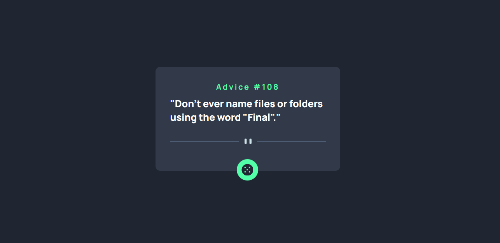

# Frontend Mentor - Advice generator app solution

This is a solution to the [Advice generator app challenge on Frontend Mentor](https://www.frontendmentor.io/challenges/advice-generator-app-QdUG-13db). Frontend Mentor challenges help you improve your coding skills by building realistic projects.

## Table of contents

- [Overview](#overview)
  - [The challenge](#the-challenge)
  - [Screenshot](#screenshot)
  - [Links](#links)
- [My process](#my-process)
  - [Built with](#built-with)
  - [What I learned](#what-i-learned)
  - [Continued development](#continued-development)
- [Author](#author)
- [Acknowledgments](#acknowledgments)


## Overview

### The challenge

Users should be able to:

- View the optimal layout for the app depending on their device's screen size
- See hover states for all interactive elements on the page
- Generate a new piece of advice by clicking the dice icon

### Screenshot




### Links

- Solution URL: [Solution](index.html)
- Live Site URL: [github](https://chiwykes.github.io/Advice-Generator/)

## My process

### Built with

- Semantic HTML5 markup
- CSS custom properties
- Flexbox
- API
- Javascript


### What I learned

I learnt how to make use of API, to fetch data and display it.

```js
async function FetchData(){
    const response = await fetch("https://api.adviceslip.com/advice");
    const json = await response.json();
    console.log(json)
    ad_title.innerText =`Advice #${json.slip.id}`;
    ad_body.innerText =`"${json.slip.advice}"`;
  }
  dice.addEventListener("click",FetchData);
```


### Continued development

I will continue to learn more ways to use API in my web designs.


## Author

- Website - [Chiwykes](https://chiwykes.github.io/Advice-Generator/)
- Frontend Mentor - [@chiwykes](https://www.frontendmentor.io/profile/chiwykes)


## Acknowledgments

I would like to extend my gratitude to tech upfront. His videos helped me to understand how to apply API in order to complete this challenge.
